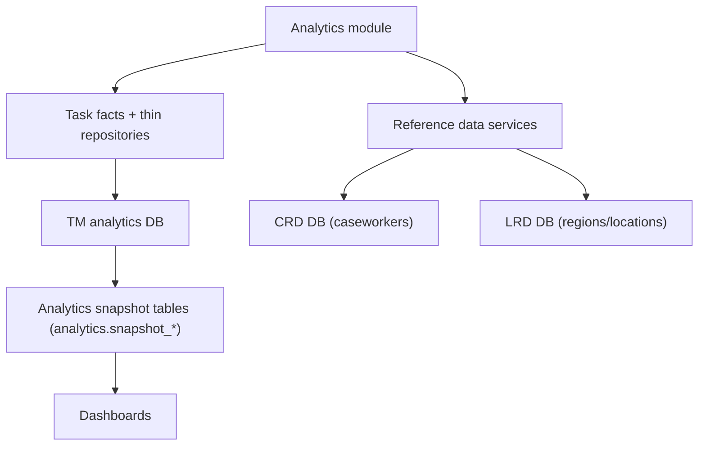

# Data sources and data model

## Databases
The application connects to three PostgreSQL databases using Prisma clients and raw SQL:

1. Task Management analytics database (`tm`)
- Purpose: snapshot-backed analytics for work allocation tasks.
- Prisma client: `tmPrisma`.
- Config prefix: `database.tm`.

2. Caseworker reference database (`crd`)
- Purpose: caseworker profiles for user display names.
- Prisma client: `crdPrisma`.
- Config prefix: `database.crd`.

3. Location reference database (`lrd`)
- Purpose: region and court venue descriptions.
- Prisma client: `lrdPrisma`.
- Config prefix: `database.lrd`.

Connection building:
- Uses `database.<prefix>.url` when provided; otherwise builds from host/port/user/password/db_name/schema.
- Optional `schema` is passed via PostgreSQL `search_path` in the connection string.
- Prisma clients are created with `PrismaPg({ connectionString })`.

Performance review:
- The post-redesign benchmark pass and current remaining opportunities live in [docs/technical/analytics-benchmark-report.md](/Users/danlysiak/development/hmcts/expressjs-speckit-powerbi/docs/technical/analytics-benchmark-report.md).
- The redesign rationale and original review notes live in [docs/technical/analytics-query-performance-review.md](/Users/danlysiak/development/hmcts/expressjs-speckit-powerbi/docs/technical/analytics-query-performance-review.md).
- The current schema described below is the implemented post-redesign state.
- The `analytics` schema is owned in this repository through Flyway migrations under `db/migrations/tm/`.

## Snapshot model
All analytics reads are snapshot-scoped:

- `snapshot_id = :snapshotId`

Published snapshots are immutable. The app reads one selected snapshot at a time.
The application reads these tables only; it does not apply Flyway migrations at startup.

The app keeps a separate in-process NodeCache entry for the current published snapshot metadata using `analytics.publishedSnapshotCacheTtlSeconds`. That fast path is only used when a request has no `snapshotToken` or when the signed `snapshotToken` matches the cached current published snapshot id. Requests for older snapshot ids still validate against `analytics.snapshot_batches` so retention cleanup cannot leave a stale historical snapshot marked as valid.

### Snapshot metadata

#### analytics.snapshot_batches
Snapshot lifecycle metadata.

Required columns:
- `snapshot_id`
- `status`
- `started_at`
- `completed_at`
- `error_message`

#### analytics.snapshot_state
Single-row publish pointer.

Required columns:
- `published_snapshot_id`
- `published_at`
- `in_progress_snapshot_id`

## Snapshot refresh procedure
Snapshots are built and published by `analytics.run_snapshot_refresh_batch()`.

Current refresh shape:
- Full rebuild from `cft_task_db.reportable_task`.
- `analytics.run_snapshot_refresh_batch()` now acts as a coordinator over internal helpers for temp-table staging, detached partition creation, detached data population, core index creation, filter-fact materialisation, and filter-index creation.
- Creates a narrow temp staging table with only the columns and derived values needed by the app.
- Builds detached per-snapshot tables for every snapshot parent before publish.
- Loads thin row tables first, then facts, then page-scoped facet tables.
- Populates `analytics.snapshot_outstanding_due_status_daily_facts` and `analytics.snapshot_outstanding_created_assignment_daily_facts` directly from `tmp_snapshot_fact_source` for the `/outstanding` aggregate workloads.
- Populates `analytics.snapshot_completed_dashboard_facts` directly from `tmp_snapshot_fact_source` for the `/completed` aggregate workload.
- Runs `ANALYZE` on every detached snapshot table before publish.
- Commits the detached build tables before publish, then opens a short publish transaction that only attaches those tables as partitions and updates `analytics.snapshot_state`.
- Keeps the previous published snapshot readable during the detached build phase because the live parent tables are not modified until the final attach step.

Refresh-time derived values materialised in staging:
- `wait_time_days`
- `handling_time_days`
- `processing_time_days`
- `days_beyond_due`
- `within_due_sort_value`
- `termination_reason_lower`

Refresh-time session settings:
- Baseline refresh work: `work_mem = 256MB`, `maintenance_work_mem = 1GB`
- Aggregate fact builds temporarily use `work_mem = 1GB`, `hash_mem_multiplier = 4`, `enable_sort = off`
- Facet aggregation temporarily uses `work_mem = 1GB`, `hash_mem_multiplier = 4`, `enable_sort = off`

Retention:
- Keeps the published snapshot, any in-progress snapshot, and the latest 3 succeeded snapshots.
- Cleans up obsolete snapshots after publish by first detaching their child tables from the live parents in a short lock-bounded step, then dropping the detached tables.
- If retention cleanup cannot get the required parent lock quickly, it logs a warning and leaves that obsolete snapshot for a later run.
- Keeps up to 100 failed batch records.

## Core analytics snapshot tables

### analytics.snapshot_open_task_rows
Thin row store for row-backed open or otherwise not-completed task views.

Used by:
- `/users` assigned table and assigned count
- `/users` assigned total and priority summary when a `User` filter is active
- `/outstanding` critical tasks table

Row population rule:
- Includes source rows where `state NOT IN ('COMPLETED', 'TERMINATED')`

Required columns:
- `snapshot_id`
- `task_id`
- `case_id`
- `task_name`
- `case_type_label`
- `jurisdiction_label`
- `role_category_label`
- `region`
- `location`
- `work_type`
- `state`
- `created_date`
- `first_assigned_date`
- `due_date`
- `major_priority`
- `assignee`
- `number_of_reassignments`

Notes:
- The `/users` assigned table adds `state = 'ASSIGNED'` on top of this table.
- Priority rank is still calculated at query-time from `major_priority`, `due_date`, and `CURRENT_DATE`.
- Child partitions also create a User Overview-specific partial index for the default assigned-table query: non-Judicial `state = 'ASSIGNED'` rows ordered by `created_date DESC` semantics.

### analytics.snapshot_completed_task_rows
Thin row store for completed-task row views.

Used by:
- `/users` completed table and completed row count
- `/completed` task audit

Row population rule:
- Includes source rows where `LOWER(termination_reason) = 'completed'`

Required columns:
- `snapshot_id`
- `task_id`
- `case_id`
- `task_name`
- `jurisdiction_label`
- `role_category_label`
- `region`
- `location`
- `work_type`
- `created_date`
- `first_assigned_date`
- `due_date`
- `completed_date`
- `handling_time_days`
- `is_within_sla`
- `termination_process_label`
- `outcome`
- `major_priority`
- `assignee`
- `number_of_reassignments`
- `within_due_sort_value`

Notes:
- Runtime analytics queries no longer append `NULLS LAST` to completed-table sorts.
- The pre-existing completed-row index set continues to cover the `completed_date`, `case_id`, and `within_due_sort_value` sorts used by User Overview.
- Child partitions also create User Overview-specific non-Judicial partial indexes for the remaining completed-table sorts that were proven slow in production or local benchmarking. The extra coverage is one ascending partial index per sort key for `created_date`, `first_assigned_date`, `due_date`, `handling_time_days`, `assignee`, `task_name`, `location`, and total assignments (`COALESCE(number_of_reassignments, 0) + 1`).
- Local planner tests showed that once `NULLS LAST` was removed from the runtime SQL, one ascending partial index per remaining completed sort key served both ascending and descending queries, so direction-specific duplicates are no longer required in `V009`.

### analytics.snapshot_user_completed_facts
Assignee-aware completed-task facts for the User Overview page.

Used by:
- `/users` completed total
- `/users` completed summary
- `/users` completed by date
- `/users` completed by task name

Population rule:
- Source rows where `LOWER(termination_reason) = 'completed'` and `completed_date IS NOT NULL`
- Grouped by assignee, shared slicers, and `completed_date`

Required columns:
- `snapshot_id`
- `assignee`
- `jurisdiction_label`
- `role_category_label`
- `region`
- `location`
- `task_name`
- `work_type`
- `completed_date`
- `tasks`
- `within_due`
- `beyond_due`
- `handling_time_sum`
- `handling_time_count`
- `days_beyond_sum`
- `days_beyond_count`

Notes:
- `handling_time_sum` uses `COALESCE(handling_time_days, 0)` so null handling times remain in the task denominator for the `/users` completed-by-task-name table.
- `days_beyond_sum` uses the refresh-time `days_beyond_due` value derived from `due_date_to_completed_diff_time`, also with nulls treated as zero.
- `days_beyond_count` preserves `COUNT(*)` semantics for the `/users` completed-by-task-name average.
- On the combined `/users` completed overview AJAX path, the completed summary and completed-table pagination totals are derived from the completed-by-date aggregate over this table instead of a separate summary query.
- On completed-only child refreshes (`user-overview-completed`), the dedicated completed summary aggregate is still used so completed-table sort and pagination do not trigger the completed-by-date aggregate.

### analytics.snapshot_outstanding_due_status_daily_facts
Page-scoped due-status fact table for the `/outstanding` tasks-due workload.

Used by:
- `/outstanding` tasks due chart
- `/outstanding` tasks due table

Population rule:
- Source rows where `due_date IS NOT NULL` and `task_status IN ('open', 'completed')`
- Grouped by shared slicers plus `due_date`
- Populated directly from `tmp_snapshot_fact_source` during refresh

Required columns:
- `snapshot_id`
- `due_date`
- `jurisdiction_label`
- `role_category_label`
- `region`
- `location`
- `task_name`
- `work_type`
- `open_task_count`
- `completed_task_count`

Notes:
- This table intentionally stores only the open/completed counts needed by the tasks-due chart and table.

### analytics.snapshot_outstanding_created_assignment_daily_facts
Page-scoped created-date assignment fact table for the `/outstanding` open-tasks-by-created-date workload.

Used by:
- `/outstanding` open tasks by created date chart
- `/outstanding` open tasks by created date table

Population rule:
- Source rows where `created_date IS NOT NULL` and `task_status = 'open'`
- Grouped by shared slicers plus `reference_date = created_date` and `assignment_state`
- Populated directly from `tmp_snapshot_fact_source` during refresh

Required columns:
- `snapshot_id`
- `reference_date`
- `jurisdiction_label`
- `role_category_label`
- `region`
- `location`
- `task_name`
- `work_type`
- `assignment_state`
- `task_count`

Notes:
- `assignment_state` is the refresh-time Assigned/Unassigned classification already used elsewhere on `/outstanding`.
### analytics.snapshot_completed_dashboard_facts
Page-scoped completed-task fact table for the `/completed` aggregate workload.

Used by:
- `/completed` completed summary
- `/completed` completed timeline
- `/completed` completed by name / region / location
- `/completed` processing and handling time

Population rule:
- Source rows where `completed_date IS NOT NULL` and `LOWER(termination_reason) = 'completed'`
- Grouped by shared slicers plus `reference_date = completed_date`
- Populated directly from `tmp_snapshot_fact_source` during refresh

Required columns:
- `snapshot_id`
- `reference_date`
- `jurisdiction_label`
- `role_category_label`
- `region`
- `location`
- `task_name`
- `work_type`
- `total_task_count`
- `within_task_count`
- `handling_time_days_sum`
- `handling_time_days_sum_squares`
- `handling_time_days_count`
- `processing_time_days_sum`
- `processing_time_days_sum_squares`
- `processing_time_days_count`

Notes:
- `/completed` processing and handling time reconstructs averages and population standard deviations from `sum`, `sum_squares`, and `count`.
- The `/completed` region and region/location tables are served from one `GROUPING SETS ((location, region), (region))` aggregate over this table.

### analytics.snapshot_open_due_daily_facts
Open-task fact table for the shared due/open aggregate workload.

Used by:
- `/` service overview
- `/outstanding` open-task summary
- `/outstanding` open tasks by name
- `/outstanding` open tasks by region/location
- `/outstanding` tasks due by priority
- `/users` assigned total and priority summary when no `User` filter is active

Population rule:
- Source rows where `due_date IS NOT NULL`
- Only open-task classification (`state IN ('ASSIGNED', 'UNASSIGNED', 'PENDING AUTO ASSIGN', 'UNCONFIGURED')`)
- Grouped by shared slicers plus `due_date`, `priority`, and `assignment_state`

Required columns:
- `snapshot_id`
- `due_date`
- `jurisdiction_label`
- `role_category_label`
- `region`
- `location`
- `task_name`
- `work_type`
- `priority`
- `assignment_state`
- `task_count`

Notes:
- This table intentionally omits completed and created event slices.
- Priority buckets are still derived at read time from `priority` and `due_date` so ageing snapshots preserve current semantics.

### analytics.snapshot_task_event_daily_facts
Overview event fact table for created, completed, and cancelled counts by date and shared slicers.

Used by:
- `/` task events by service

Population rule:
- Created rows where `created_date IS NOT NULL`
- Completed rows where `completed_date IS NOT NULL` and `LOWER(termination_reason) = 'completed'`
- Cancelled rows where `completed_date IS NOT NULL` and `LOWER(termination_reason) = 'deleted'`
- Grouped by shared slicers plus `event_date` and `event_type`

Required columns:
- `snapshot_id`
- `event_date`
- `event_type`
- `jurisdiction_label`
- `role_category_label`
- `region`
- `location`
- `task_name`
- `work_type`
- `task_count`

Notes:
- This table intentionally omits `priority` and `task_status`.
- The refresh aggregates across those fields so Overview event counts cannot be duplicated by dimensions that the UI never groups on.

### analytics.snapshot_wait_time_by_assigned_date
Assigned-task wait-time facts.

Used by:
- `/outstanding` wait time by assigned date

Population rule:
- Source rows where `state = 'ASSIGNED'` and `wait_time_days IS NOT NULL`
- Grouped by shared slicers plus `first_assigned_date`

Required columns:
- `snapshot_id`
- `reference_date`
- `jurisdiction_label`
- `role_category_label`
- `region`
- `location`
- `task_name`
- `work_type`
- `total_wait_time_days_sum`
- `assigned_task_count`

### Page-scoped filter facet tables
The generic `snapshot_filter_facet_facts` table has been replaced with page-scoped facet tables so dropdowns reflect the workload each page actually uses.

Common columns:
- `snapshot_id`
- `jurisdiction_label`
- `role_category_label`
- `region`
- `location`
- `task_name`
- `work_type`
- `row_count`

User-only extra column:
- `assignee` on `analytics.snapshot_user_filter_facts` only

#### analytics.snapshot_overview_filter_facts
Facet source for `/`.

Population rule:
- Aggregated from the union of:
  - `snapshot_open_due_daily_facts`
  - `snapshot_task_event_daily_facts`

#### analytics.snapshot_outstanding_filter_facts
Facet source for `/outstanding`.

Population rule:
- Aggregated from `snapshot_open_task_rows`

Used by:
- `/outstanding` shared filter options
- `/outstanding` critical tasks total count

#### analytics.snapshot_completed_filter_facts
Facet source for `/completed`.

Population rule:
- Aggregated from `snapshot_completed_task_rows`

#### analytics.snapshot_user_filter_facts
Facet source for `/users`.

Population rule:
- Aggregated from:
  - `snapshot_open_task_rows` where `state = 'ASSIGNED'`
  - all `snapshot_completed_task_rows`
- User Overview's Judicial exclusion is applied during this materialisation step as well as at query time.

Notes for all facet tables:
- Blank strings are normalised to `NULL` at materialisation time.
- Work type display labels are still resolved at read-time by joining `cft_task_db.work_types`.
- User Overview still applies its query-time Judicial exclusion when reading row and fact queries.
- Unfiltered non-user scopes (`/`, `/outstanding`, and `/completed`) read filter options with one `GROUPING SETS` query per page-scoped facet table.
- Filtered states still use per-facet queries so each dropdown can exclude its own active filter while respecting the others.

Flyway ownership note:
- The current schema shape documented in this file is the target state produced by the repository-owned Flyway migrations under `db/migrations/tm/`.
- `db/current-state/tm-analytics-schema.sql` is the rerunnable current-state mirror of that end state for local and disposable rebuild workflows; it is maintained alongside the migrations but is not migration history.
- Upstream dependencies remain external: Flyway does not create `cft_task_db.reportable_task` or `cft_task_db.work_types`.

## Reference data

### CRD: vw_case_worker_profile
Used to map assignee IDs to names.

Required columns:
- `case_worker_id`
- `first_name`
- `last_name`
- `email_id`
- `region_id`

Outstanding-specific rule:
- On `/outstanding` critical tasks, if an assignee ID exists with no CRD match, the UI shows `Judge`.

### LRD: region
Used for region descriptions.

Required columns:
- `region_id`
- `description`

### LRD: court_venue
Used for location descriptions.

Required columns:
- `epimms_id`
- `site_name`
- `region_id`

## Filter mapping
Shared filter mappings:
- Service -> `jurisdiction_label`
- Role category -> `role_category_label`
- Region -> `region`
- Location -> `location`
- Task name -> `task_name`
- Work type -> `work_type`
- User -> `assignee` (User Overview only)

Date filter mappings:
- `completedFrom` / `completedTo` -> `completed_date` in completed row / user-completed facts, or `reference_date` in completed dashboard facts
- `eventsFrom` / `eventsTo` -> `reference_date` in task-daily facts for created / completed / cancelled events

Scoped exclusions:
- User Overview applies `UPPER(role_category_label) <> 'JUDICIAL'` (null-safe).
- The Judicial exclusion does not apply on `/`, `/outstanding`, or `/completed`.

## Derived concepts

### Priority rank
Priority rank is calculated in SQL at read time from `major_priority` or `priority` plus `CURRENT_DATE`:

- `<= 2000 => 4`
- `< 5000 => 3`
- `= 5000` and `due_date < CURRENT_DATE => 3`
- `= 5000` and `due_date = CURRENT_DATE => 2`
- else `1`

UI label mapping:
- `4 => Urgent`
- `3 => High`
- `2 => Medium`
- `1 => Low`

### Within due date
Within due date is computed as:
- `is_within_sla = 'Yes'` when present
- otherwise `completed_date <= due_date`

### Completed-task determination
Completed-task paths use case-insensitive `termination_reason = 'completed'`.
Task `state` is not used to classify completion.

### Cancelled-event determination
Overview cancelled task events use case-insensitive `termination_reason = 'deleted'`.
The facts-backed metric stores those rows as `date_role = 'cancelled'` and `task_status = 'cancelled'`, and it does not apply an additional `state` predicate.

### User Overview task-name averages
`/users` "Completed tasks by task name" preserves the previous averages while reading facts instead of rows:

- Average handling time (days):
  - `SUM(handling_time_sum) / SUM(tasks)`
- Average days beyond due date:
  - `SUM(days_beyond_sum) / SUM(days_beyond_count)`

Those fact columns are populated so null intervals still contribute zero to the numerator while remaining in the denominator.

### Completed processing and handling time
`/completed` processing/handling time is derived from completed dashboard facts:

- Average = `sum / count`
- Population standard deviation = `sqrt((sum_squares / count) - power(sum / count, 2))`

This keeps the page facts-backed while preserving the same aggregates as the source row query.

## Caching
NodeCache caches:
- Filter options
- Caseworker profiles and names
- Regions and region descriptions
- Court venues and location descriptions

These caches use the configurable `analytics.cacheTtlSeconds` TTL.

The app also keeps a dedicated NodeCache entry for the current published snapshot metadata using `analytics.publishedSnapshotCacheTtlSeconds`. That cache is intentionally separate from `analytics.cacheTtlSeconds` so current snapshot routing can use a much shorter TTL than filter and reference caches.
